# 系统分析与设计

## 1. 需求分析

### 1.1 系统概述

`lightweight-ip-traffic-sa` 是一个面向 IP 多特征融合的轻量化安全态势感知系统。系统采用前后端分离架构，后端基于 Go、Gin、Gorm、MySQL、Redis、JWT 和 YAML 配置实现，前端基于 Vue 3、Vite、Vue Router、Pinia、Axios、Element Plus 与 ECharts 实现。

系统建设目标是打通“登录鉴权 -> 安全任务 -> 特征采集/评分 -> 总览展示 -> 预警与记录”的主链路，并在此基础上扩展真实数据源、离线流量解析、短时在线抓包和实时流量监控能力。当前系统已经形成 `system + security` 双域结构，其中 `system` 负责登录、用户、权限和审计能力，`security` 负责任务、总览、历史、预警、配置和流量增强能力。

当前系统主要解决以下问题：

- 传统 IP 风险判断维度单一，缺少基础画像、信誉、攻击面与流量行为的融合分析。
- 外部数据源依赖不稳定，需要支持本地优先、失败降级和缓存隔离。
- 安全分析结果需要面向任务、总览、历史和预警形成可追溯展示。
- 流量分析能力需要保持增强链路定位，不应阻断默认业务主链。

系统边界如下：

- 默认业务主链覆盖登录鉴权、安全任务、静态/动态特征采集、融合评分、总览展示、历史记录和预警中心。
- 流量增强链路覆盖离线 pcap/pcapng 解析、短时在线抓包、流量特征落库和任务详情承接。
- 实时流量监控为独立网卡监听能力，写入预警中心，不进入默认任务历史三表。
- 外部数据源采用可配置、可降级策略，不作为系统启动和任务创建的硬依赖。

### 1.2 功能需求

| 功能模块 | 主要功能 | 参与角色 |
| --- | --- | --- |
| 登录鉴权 | 用户登录、登出、当前用户信息获取、JWT 鉴权、路由权限控制 | 超级管理员、管理员、普通用户 |
| 用户管理 | 用户列表、新增用户、状态修改、密码重置 | 超级管理员 |
| 安全任务 | 创建任务、任务列表、任务详情、任务删除 | 超级管理员、管理员、普通用户 |
| IP 多特征采集 | GeoLite2、RDAP、本地黑名单、AbuseIPDB、端口探测、Nmap 原型、流量特征 | 超级管理员、管理员 |
| 风险评分 | 基础画像、信誉、攻击面、行为特征、规则调整和风险等级计算 | 超级管理员、管理员、普通用户 |
| 态势总览 | 汇总指标、趋势图、风险分布、地理风险聚合 | 超级管理员、管理员、普通用户 |
| 历史记录 | 任务记录与预警记录聚合查询 | 超级管理员、管理员、普通用户 |
| 预警中心 | 预警列表、预警详情、任务预警、实时流量监控预警 | 超级管理员、管理员、普通用户 |
| 安全配置 | 评分阈值、数据源开关、流量采集配置、SMTP 配置、网卡枚举 | 超级管理员、管理员 |
| 实时流量监控 | 创建监听会话、查询会话、停止会话、观察面板 | 超级管理员、管理员、普通用户 |
| 审计日志 | 登录、任务、配置、监控和预警发送行为记录 | 超级管理员 |

### 1.3 用例图

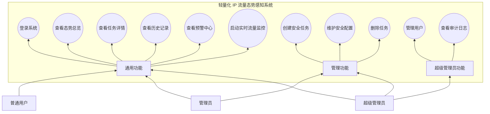

### 1.4 核心用例描述

| 用例 | 触发者 | 前置条件 | 主流程 | 异常流程 | 后置结果 |
| --- | --- | --- | --- | --- | --- |
| 登录系统 | 超级管理员、管理员、普通用户 | 用户账号已启用 | 输入账号密码，后端校验密码，签发 JWT，前端保存登录态 | 密码错误、账号停用或服务异常时返回失败提示 | 用户进入授权页面 |
| 创建安全任务 | 超级管理员、管理员 | 已登录且具备任务创建权限 | 输入目标 IP，创建任务记录，执行采集、评分、预警判断，清理总览缓存 | 目标 IP 非法、采集源失败或评分异常时进入失败/降级路径 | 形成任务详情、评分结果和可能的预警 |
| 查看任务详情 | 超级管理员、管理员、普通用户 | 已登录且任务存在 | 查询任务、基础画像、特征、评分、预警和流量证据 | 任务不存在时返回错误；部分增强数据缺失时页面降级展示 | 用户获得完整证据链 |
| 维护安全配置 | 超级管理员、管理员 | 已登录且具备配置权限 | 读取配置，修改阈值、数据源、流量和邮件参数，写库并刷新缓存 | 参数非法或保存失败时返回错误 | 新配置对后续任务生效 |
| 启动实时流量监控 | 超级管理员、管理员、普通用户 | 已登录，主机具备抓包环境 | 选择网卡，创建监控会话，系统按窗口采样并判断风险 | 网卡不可用或抓包失败时会话失败 | 会话状态可查询，高风险事件写入预警中心 |

## 2. 系统静态模型

### 2.1 核心类图

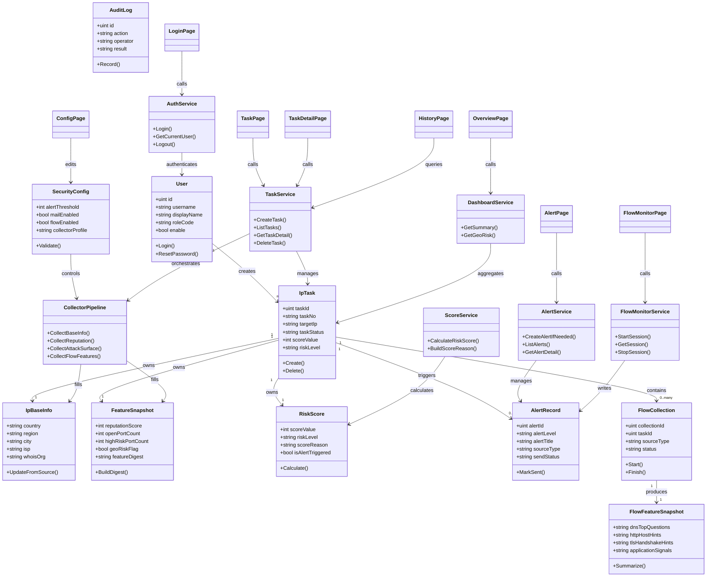

### 2.2 分层结构图

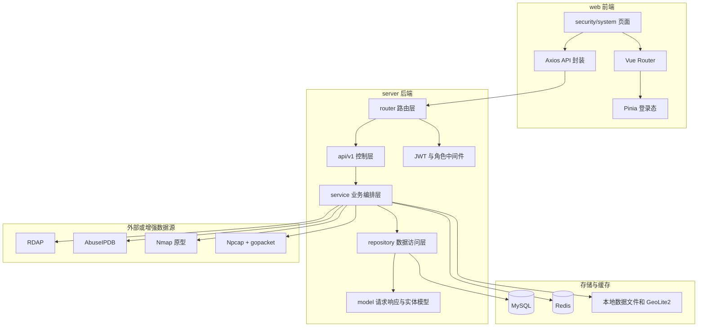

### 2.3 包图

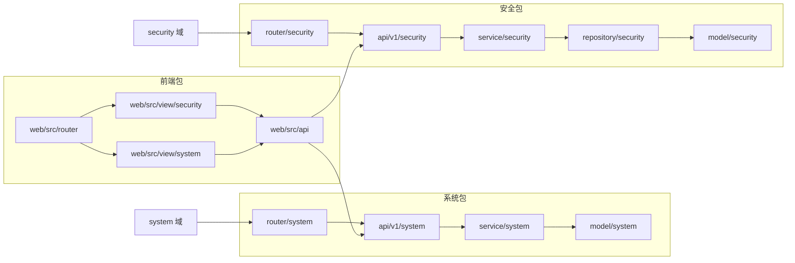

## 3. 系统动态模型

### 3.1 登录鉴权顺序图

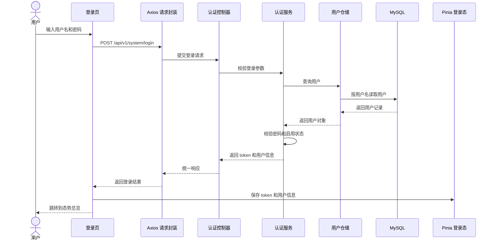

### 3.2 安全任务创建与多源采集评分顺序图

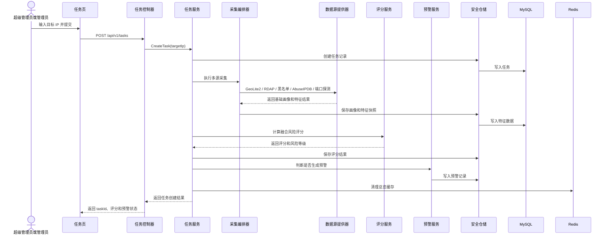

### 3.3 实时流量监控顺序图

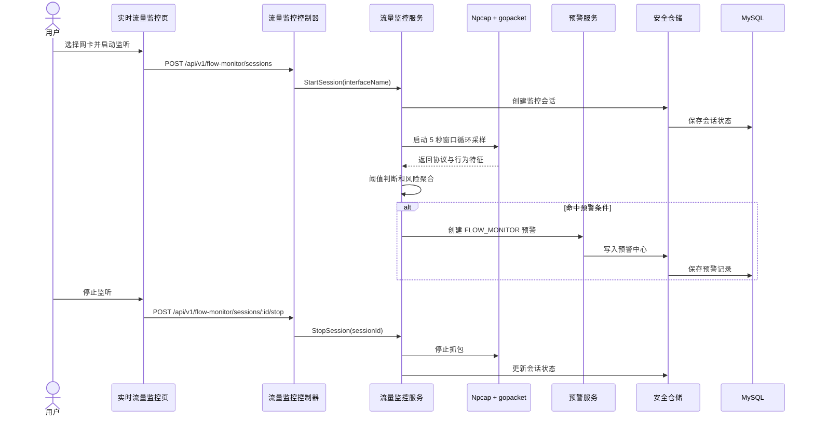

### 3.4 主业务活动图

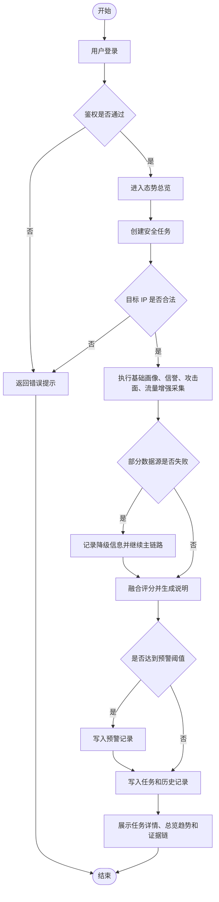

### 3.5 安全任务状态图

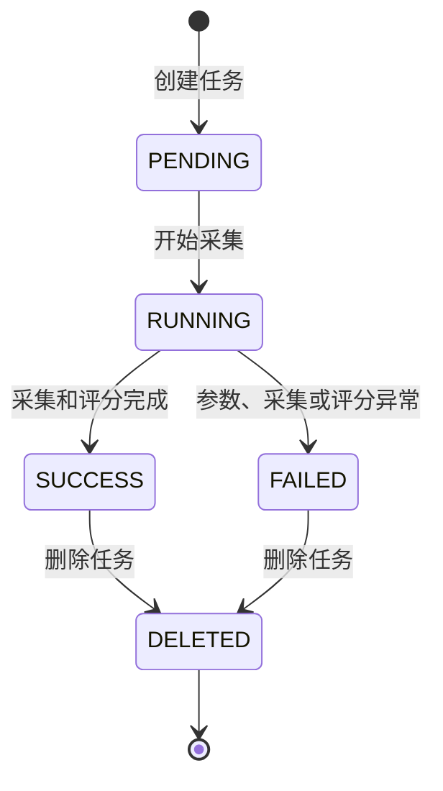

### 3.6 实时流量监控会话状态图

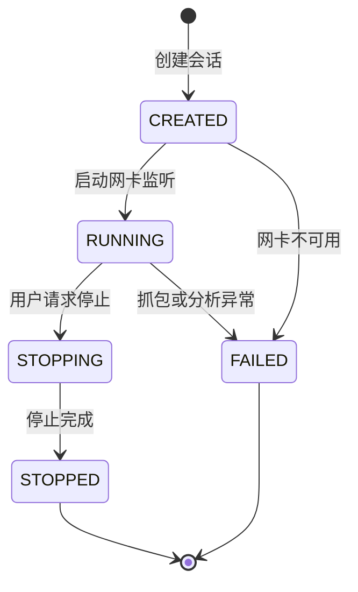

## 4. 系统部署

### 4.1 组件图

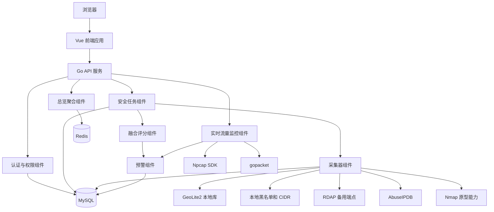

### 4.2 部署图

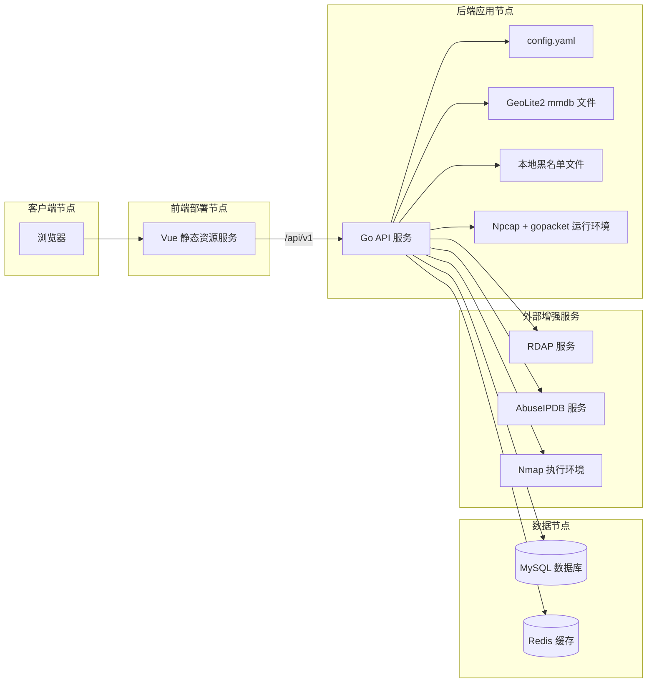

### 4.3 部署约束

- 后端接口统一挂载在 `/api/v1` 前缀下，除 `POST /api/v1/system/login` 外，其余业务接口默认需要 JWT。
- MySQL 是任务、评分、预警、配置、流量和审计数据的主存储。
- Redis 用于总览和配置等短 TTL 缓存，Redis 不可用时系统应降级为无缓存模式。
- GeoLite2、本地黑名单和 CIDR 文件属于本地优先数据源，缺失时不得阻断任务主链路。
- RDAP、AbuseIPDB、Nmap 属于增强数据源或原型能力，必须支持超时、失败降级和配置开关。
- Npcap + gopacket 主要服务于短时在线抓包、离线流量解析和实时流量监控，不作为所有安全任务的默认前置条件。

## 5. 设计结论

本系统更适合采用“面向对象分析方法为主、结构化分析方法为辅”的设计表达方式。用户、任务、画像、特征、评分、预警、配置、流量采集和审计日志等对象具有明确属性、行为和关联关系，适合通过类图、组件图、包图和部署图描述；登录鉴权、安全任务创建、采集评分、预警生成和实时流量监控等流程具有清晰的时序和状态变化，适合通过顺序图、活动图和状态图描述。

该设计方式既能体现当前代码中的前后端分层、服务编排和仓储模型，也能满足系统设计文档对需求分析、静态模型、动态模型和部署模型的表达要求。
